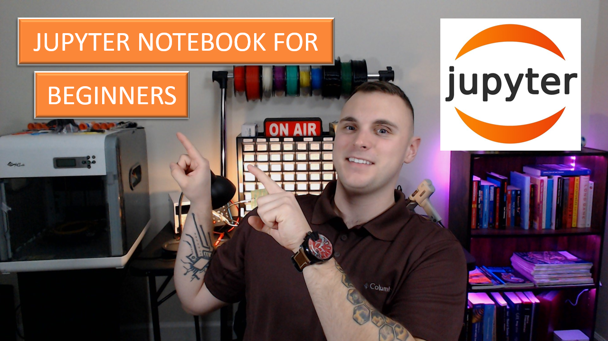

<!--
*** CHANGE THE FOLLOWING PARAMETERS TO FILL THE TEMPLATE
*** REPOSITORY_NAME: name of the repository
*** REPOSITORY_DESCRIPTION: description of the repository
*** YOUTUBE_VIDEO_LINK: link to the YouTube tutorial
*** YOUTUBE_VIDEO_THUMBNAIL: thumbnail of the YouTube tutorial
*** BUILT_WITH: packages and tools used
*** INSTALLATION_DESCRIPTION: description of installation instructions
*** INSTALLATION_INSTRUCTIONS: instructions for installing packages
*** PREREQUISITE_INSTRUCTIONS: instructions for prerequisite materials
*** USAGE_DESCRIPTION: description of usage example
*** USAGE_IMAGE: link to usage example image
*** PROGRESS_STATUS: status of repository progress
-->

<!-- PROJECT LOGO -->

    <h2>Jupyter Notebook</h2>
    
    <h6 align="center"><i><b>Click the Image Above to View this Tutorial on YouTube</b></i></h6>

This tutorial demonstrates how to download and use Jupyter Notebook. The tutorial will guide beginners in how to structure notebooks, code scripts, and execute cells. 

<!-- TABLE OF CONTENTS -->

  
Table of Contents

  <ol>
    <li>
      <a href="#about-the-project">About The Project</a>
      <ul>
        <li><a href="#built-with">Built With</a></li>
      </ul>
    </li>
    <li>
      <a href="#getting-started">Getting Started</a>
      <ul>
        <li><a href="#prerequisites">Prerequisites</a></li>
        <li><a href="#installation">Installation</a></li>
      </ul>
    </li>
    <li><a href="#usage">Usage</a></li>
    <li><a href="#progress">Progress</a></li>
    <li><a href="#contributing">Contributing</a></li>
    <li><a href="#license">License</a></li>
    <li><a href="#contact">Contact</a></li>
  </ol>

<!-- ABOUT THE PROJECT -->

## About The Project

    
    <h2>Push The Envelope</h2>
     
    

The PushTheEnvelope YouTube channel, is a channel dedicated to teaching up and coming data scientists or those curious about topics such as artificial intelligence, machine learning, and data analytics. Through various lessons and tutorials, learn how to go from no experience to on your way to becoming an expert. 

(<a href="#top">back to top</a>)

### Built With

* [Anaconda](https://anaconda.org/)

(<a href="#top">back to top</a>)

<!-- GETTING STARTED -->
</a>

## Getting Started

This installation uses Jupyter Notebook via Anaconda, a data science software distribution for Python and R packages. It is highly recommended that beginners use Anaconda as it contains a collection of data science tools and a package management system that is easy to use and comes pre installed with the most common data science packages. 

### Prerequisites

* Install [Anaconda](https://Anaconda.com/)
* Install [Git](https://git-scm.com/download/) *_(optional)_*
* Some installation steps may require admin privileges

### Installation

1. Navigate to [Anaconda.org](https://anaconda.org/)
2. Download the latest Anaconda distribution
	* _Ensure it is the correct version for your operating system_

(<a href="#top">back to top</a>)

<!-- USAGE EXAMPLES -->

## Usage

Below is an example of how Jupyter Notebook is layed out and how to execute basic commands

(<a href="#top">back to top</a>)

<!-- ROADMAP -->

## Progress

- [X] Tutorial

(<a href="#top">back to top</a>)

<!-- CONTRIBUTING -->

## Contributing

Contributions are what make the open source community such an amazing place to learn, inspire, and create. Any contributions you make are **greatly appreciated**.

If you have a suggestion that would make this better, please fork the repo and create a pull request. You can also simply open an issue with the tag "enhancement".
Please note, these tutorials are meant to teach beginners data science techniques, tools, and strategies. Solutions may intentionally be vague or incomplete to allow for learning or adoption to real-world use cases. 

Don't forget to give the project a star! Thanks again!

1. Fork the Project
2. Create your Feature Branch (`git checkout -b feature/AmazingFeature`)
3. Commit your Changes (`git commit -m 'Add some AmazingFeature'`)
4. Push to the Branch (`git push origin feature/AmazingFeature`)
5. Open a Pull Request

(<a href="#top">back to top</a>)

<!-- LICENSE -->

## License

Distributed under the MIT License. See `LICENSE.txt` for more information.

(<a href="#top">back to top</a>)

<!-- CONTACT -->

## Contact

<h4 align="left">Adam Bordeau</h4>

LinkedIn: [Adam Bordeau](https://linkedin.com/in/adam-bordeau-24912b241) 
YouTube: [PushTheEnvelope](https://www.youtube.com/channel/UCjtoiXWlWt0VWoeN7tEjUbg/featured) 
GitHub: [PushTheEnvelopeAI](https://github.com/PushTheEnvelopeAI) 
Email: [PushTheEnvelopeAI@gmail.com](PushTheEnvelopeAI@gmail.com)

(<a href="#top">back to top</a>)

