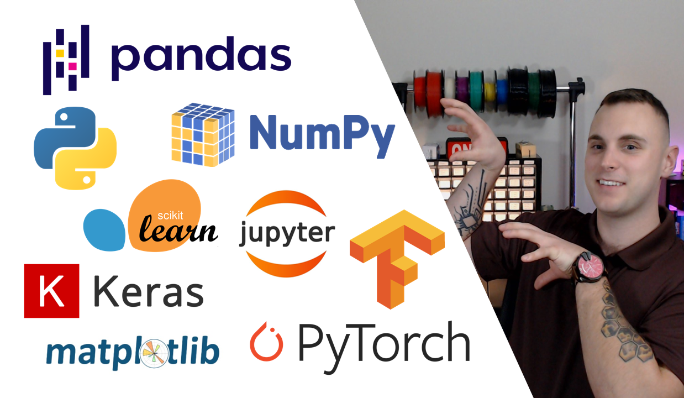
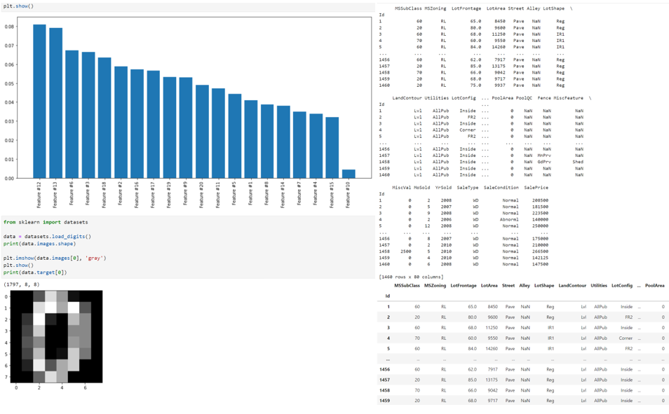

<a name="top"/></a>

<!-- PROJECT LOGO -->
<div style="text-align: center;">
    <h2>Python Package Tutorials</h2>
    <a href="https://www.youtube.com/watch?v=uZQeBw_G9-8">
        
    </a>
    <h6 align="center"><i><b>Click the Image Above to View this Tutorial on YouTube</b></i></h6>
    <h4 align="center">This is a repository dedicated to learning how to use some of the most common data science packages and tools in Python. Click into each repository to review individuals notebooks with coding examples along with video tutorial recordings linked in the descriptions and hosted on the PushTheEnvelope YouTube channel.</h4>
</div>


<!-- TABLE OF CONTENTS -->
<details>
  <summary>Table of Contents</summary>
  <ol>
    <li>
      <a href="#about-the-project">About The Project</a>
      <ul>
        <li><a href="#built-with">Built With</a></li>
      </ul>
    </li>
    <li>
      <a href="#getting-started">Getting Started</a>
      <ul>
        <li><a href="#prerequisites">Prerequisites</a></li>
        <li><a href="#installation">Installation</a></li>
      </ul>
    </li>
    <li><a href="#usage">Usage</a></li>
    <li><a href="#progress">Progress</a></li>
    <li><a href="#contributing">Contributing</a></li>
    <li><a href="#license">License</a></li>
    <li><a href="#contact">Contact</a></li>
  </ol>
</details>


<!-- ABOUT THE PROJECT -->
<a name="about-the-project"/></a>

## About The Project

<div style="text-align: center;">
    <a href="https://www.youtube.com/channel/UCjtoiXWlWt0VWoeN7tEjUbg">
        
    </a>
    <h2>Push The Envelope</h2>
    <br>
    
</div>

The PushTheEnvelope YouTube channel, is a channel dedicated to teaching up and coming data scientists or those curious about topics such as artificial intelligence, machine learning, and data analytics. Through various lessons and tutorials, learn how to go from no experience to on your way to becoming an expert. 

<p align="right">(<a href="#top">back to top</a>)</p>


<a name="built-with"/></a>

### Built With

* [Python](https://python.org/)
* [Anaconda - Jupyter Notebook](https://anaconda.com/)
* [Pandas](https://pandas.pydata.com/)
* [Numpy](https://numpy.org/)
* [MatPlotLib](https://matplotlib.org/)
* [PyTorch](https://pytorch.org/)
* [Keras](https://keras.io/)
* [Tensorflow](https://tensorflow.org/)
* [SciKit-Learn](https://scikit-learn.org/)
* and much, much more

<p align="right">(<a href="#top">back to top</a>)</p>


<!-- GETTING STARTED -->
<a name="getting-started"/></a></a>

## Getting Started

The instructions below will guide you in installing Anaconda, a distribution and Python and R packages for scientific computing and data analytics. 
While not necessary to code the individual tutorials, it is highly recommended that beginners start with Anaconda as it provides easy to use tools, such as Jupyter Notebook, and a self-contained package management system with the most used packages pre-installed.

<a name="prerequisites"/></a>

### Prerequisites

* Install [Anaconda](https://Anaconda.com/)
* Install [Git](https://git-scm.com/download/) *_(optional)_*
* Some installation steps may require admin privledges 

<a name="installation"/></a>

### Installation

Option 1: Using Git
1. Navigate to saving repository
2. Clone repository: ```git clone https://github.com/PushTheEnvelopeAI/Python_Package_Tutorials.git```
3. Move to downloaded folder: ```cd Python_Package_Tutorials```
4. Open .ipynb files using Jupyter Notebook through Anaconda

Option 2: Without using Git
1. Go to [https://github.com/PushTheEnvelopeAI/Python_Package_Tutorials](https://github.com/PushTheEnvelopeAI/Python_Package_Tutorials)
2. Select green 'Code' dropdown
3. Select 'Download ZIP' and save to computer
4. Navigate to ZIP and extract all
5. Open .ipynb files using Jupyter Notebook through Anaconda

<p align="right">(<a href="#top">back to top</a>)</p>


<!-- USAGE EXAMPLES -->
<a name="usage"/></a>

## Usage

Below are some example outputs of the Python Package tutorials:



<p align="right">(<a href="#top">back to top</a>)</p>


<!-- ROADMAP -->
<a name="progress"/></a>

## Progress

- [X] Python
- [X] Jupyter Notebook
- [X] Pandas
- [X] Numpy
- [X] SKLearn
- [ ] MatPlotLib
- [ ] TensorFlow
- [ ] PyTorch
- [ ] SeaBorn

<p align="right">(<a href="#top">back to top</a>)</p>


<!-- CONTRIBUTING -->
<a name="contributing"/></a>

## Contributing

Contributions are what make the open source community such an amazing place to learn, inspire, and create. Any contributions you make are **greatly appreciated**.

If you have a suggestion that would make this better, please fork the repo and create a pull request. You can also simply open an issue with the tag "enhancement".
Please note, these tutorials are meant to teach beginners data science techniques, tools, and strategies. Solutions may intentionally be vague or incomplete to allow for learning or adoption to real-world use cases. 

Don't forget to give the project a star! Thanks again!

1. Fork the Project
2. Create your Feature Branch (`git checkout -b feature/AmazingFeature`)
3. Commit your Changes (`git commit -m 'Add some AmazingFeature'`)
4. Push to the Branch (`git push origin feature/AmazingFeature`)
5. Open a Pull Request

<p align="right">(<a href="#top">back to top</a>)</p>


<!-- LICENSE -->
<a name="license"/></a>

## License

Distributed under the MIT License. See `LICENSE.txt` for more information.

<p align="right">(<a href="#top">back to top</a>)</p>


<!-- CONTACT -->
<a name="contact"/></a>

## Contact

<h4 align="left">Adam Bordeau</h4>

LinkedIn: [Adam Bordeau](https://linkedin.com/in/adam-bordeau-24912b241)</br>
YouTube: [PushTheEnvelope](https://www.youtube.com/channel/UCjtoiXWlWt0VWoeN7tEjUbg/featured)</br>
GitHub: [PushTheEnvelopeAI](https://github.com/PushTheEnvelopeAI)</br>
Email: [PushTheEnvelopeAI@gmail.com](PushTheEnvelopeAI@gmail.com)

<p align="right">(<a href="#top">back to top</a>)</p>
